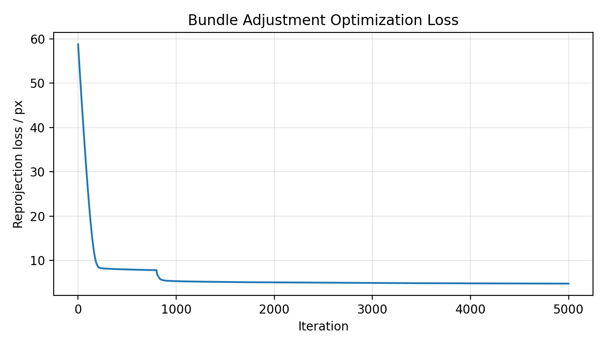

This is the assignment for the digital image processing course, PB22010370.

# Task1 
任务目标：给定多视角 2D 观测点，通过 PyTorch 自动求导和梯度下降优化，恢复相机参数与三维点云结构。具体需要优化的变量包括：

- 所有相机共享的内参焦距 \(f\)；
- 每个相机的外参，包括旋转 \(R\) 和平移 \(T\)，共 50 组相机；
- 所有三维点坐标 \((X,Y,Z)\)，共 20000 个点。

本实现使用 Euler 角对旋转矩阵进行参数化，并使用 Adam 优化器最小化 2D 重投影误差。最终输出优化过程的 loss 曲线、重建后的彩色 3D 点云 OBJ 文件，以及可交互的 Gradio 可视化界面。

---

## 1. 项目文件说明

本项目主要包含两个脚本：

| 文件名 | 功能 |
|---|---|
| `ba_task1_pytorch_v2_triangulated.py` | Bundle Adjustment 主优化脚本，负责读取 2D 观测、初始化 3D 点和相机参数、执行 PyTorch 优化，并保存结果 |
| `ba_gradio_viewer.py` | Gradio 可视化脚本，负责展示 3D 点云、loss 曲线以及每个视角下的 2D 重投影效果 |

主优化脚本会生成以下输出文件：

```text
outputs_ba_v2/
├── reconstruction.obj
├── loss_curve.png
└── optimized_params.npz
```

其中：

| 输出文件 | 含义 |
|---|---|
| `reconstruction.obj` | 最终重建得到的彩色 3D 点云 |
| `loss_curve.png` | 优化过程中重投影误差的变化曲线 |
| `optimized_params.npz` | 优化后的 3D 点、Euler 角、平移向量、焦距和 loss 记录 |

---

## 2. 环境配置

本项目使用 Python 和 PyTorch 实现。可以通过以下命令安装依赖：

```bash
pip install torch numpy matplotlib gradio plotly pillow
```

如果在 Windows 或 Conda 环境中遇到 OpenMP 冲突，例如：

```text
OMP: Error #15: Initializing libomp.dll, but found libiomp5md.dll already initialized
```

脚本中已经加入如下设置，用于缓解常见的 OpenMP 库冲突问题：

```python
import os
os.environ.setdefault("KMP_DUPLICATE_LIB_OK", "TRUE")
```

---

## 3. 数据格式

输入数据目录默认为：

```text
data/
├── points2d.npz
├── points3d_colors.npy
└── images/
    ├── ...
```

其中：

### 3.1 `points2d.npz`

`points2d.npz` 保存所有视角下的 2D 观测点。每一个视角对应一个数组，数组形状为：

```text
(N, 3)
```

其中：

- 第 1 列：2D 横坐标 \(u\)；
- 第 2 列：2D 纵坐标 \(v\)；
- 第 3 列：可见性标记，若为 1 表示该 3D 点在当前视角可见，若为 0 表示不可见。

### 3.2 `points3d_colors.npy`

`points3d_colors.npy` 保存每个 3D 点的 RGB 颜色。最终导出的 `reconstruction.obj` 文件会使用这些颜色，使点云在 MeshLab、Blender 或 Gradio 中能够以彩色形式显示。

### 3.3 `images/`

`images/` 文件夹保存各个视角对应的原图。Gradio 可视化脚本会将观测点和重投影点叠加到这些图片上，用于检查重投影误差。

---

## 4. 方法原理

### 4.1 Bundle Adjustment 的目标

Bundle Adjustment 的核心思想是：同时优化相机参数和三维点坐标，使得三维点经过相机投影后，尽可能接近真实观测到的二维点。

设第 \(j\) 个 3D 点为：

$$
P_j = (X_j,Y_j,Z_j)^T
$$

第 \(i\) 个相机的旋转和平移分别为：

$$
R_i,\quad T_i
$$

则该 3D 点在第 \(i\) 个相机坐标系下的位置为：

$$
P_{ij}^{cam} = R_i P_j + T_i
$$

记：

$$
P_{ij}^{cam} = (X_{ij}^{cam},Y_{ij}^{cam},Z_{ij}^{cam})^T
$$

再通过相机内参焦距 \(f\) 投影到 2D 图像平面：

$$
u_{ij} = -f \frac{X_{ij}^{cam}}{Z_{ij}^{cam}} + c_x
$$

$$
v_{ij} = f \frac{Y_{ij}^{cam}}{Z_{ij}^{cam}} + c_y
$$

其中 \((c_x,c_y)\) 是图像中心，在代码中设置为：

$$
c_x = c_y = \frac{\text{image\_size}}{2}
$$

本任务中 `image_size` 默认取 1024，因此图像中心默认为：

$$
c_x = c_y = 512
$$

---

## 5. 重建与优化代码原理详解

本实现的重建流程不是直接随机初始化所有变量后强行优化，而是分为以下几个步骤：

1. 读取 2D 观测；
2. 初始化相机姿态；
3. 根据多视角 2D 对应关系三角化初始化 3D 点；
4. 自动选择更合理的初始 yaw 方向；
5. 使用 PyTorch 参数化相机和 3D 点；
6. 构建可微投影函数；
7. 使用重投影误差作为主要 loss；
8. 加入轻微正则项避免点云膨胀；
9. 使用 Adam 分阶段优化；
10. 保存 loss、参数和 OBJ 点云。

下面分别说明。

---

### 5.1 读取 2D 观测

代码首先读取：

```python
obs_uv_cpu, vis_cpu, keys = load_observations(str(data_dir / "points2d.npz"))
```

其中：

- `obs_uv_cpu` 保存所有视角下的 2D 坐标；
- `vis_cpu` 保存可见性 mask；
- `keys` 保存每个视角的名称。

如果一共有 \(V\) 个相机视角和 \(N\) 个 3D 点，则：

```text
obs_uv_cpu.shape = (V, N, 2)
vis_cpu.shape    = (V, N)
```

对于本作业：

```text
V = 50
N = 20000
```

也就是说，程序需要从 50 个视角的 2D 观测中恢复 20000 个 3D 点。

---

### 5.2 Euler 角参数化旋转矩阵

代码优化每个相机的三个 Euler 角：

$$
(\alpha_i,\beta_i,\gamma_i)
$$

分别对应绕 \(x,y,z\) 轴的旋转角。

先构造三个基础旋转矩阵：

$$
R_x(\alpha),\quad R_y(\beta),\quad R_z(\gamma)
$$

然后组合成最终旋转矩阵：

$$
R = R_z R_y R_x
$$

这样做的好处是：

- 只需要优化 3 个旋转参数，而不是 9 个矩阵参数；
- 旋转矩阵由三角函数构造，天然满足旋转结构；
- 可以直接通过 PyTorch 的自动求导对 Euler 角求梯度。

代码中对应函数为：

```python
def euler_xyz_to_matrix(euler):
    ...
    return Rz @ Ry @ Rx
```

---

### 5.3 投影函数实现

投影函数是本作业最核心的函数之一。代码中对应函数为：

```python
def project_points(points3d, euler, trans, focal, image_size=1024, eps=1e-6):
    R = euler_xyz_to_matrix(euler)
    Xc = torch.einsum("vij,nj->vni", R, points3d) + trans[:, None, :]
    x, y, z = Xc[..., 0], Xc[..., 1], Xc[..., 2]

    z_safe = torch.where(z.abs() < eps, torch.full_like(z, -eps), z)
    cx = cy = image_size * 0.5

    u = -focal * x / z_safe + cx
    v =  focal * y / z_safe + cy
    uv = torch.stack([u, v], dim=-1)

    return uv, z
```

这段代码的含义是：

1. 根据 Euler 角得到每个相机的旋转矩阵 \(R_i\)；
2. 对所有相机和所有 3D 点批量计算相机坐标：

$$
X_c = R X + T
$$

3. 根据针孔相机模型将 3D 点投影到 2D；
4. 返回预测的 2D 坐标 `uv` 和相机空间深度 `z`。

其中：

```python
torch.einsum("vij,nj->vni", R, points3d)
```

表示对所有视角和所有点进行批量矩阵乘法：

- `v` 表示 view，也就是相机视角；
- `n` 表示 point，也就是三维点；
- `i,j` 表示三维坐标维度。

因此输出形状为：

```text
(V, N, 3)
```

这比逐个相机、逐个点循环计算更高效。

---

### 5.4 线性三角化初始化 3D 点

如果直接随机初始化 20000 个 3D 点，再同时优化 50 个相机参数，优化很容易陷入较差局部最优，甚至出现点云鼓包、膨胀或整体形状不稳定的问题。

因此代码中加入了三角化初始化。三角化的基本思想是：

同一个 3D 点在多个相机视角下有多个 2D 观测，这些 2D 观测可以反推出该 3D 点在空间中的初始位置。

在投影公式中：

$$
u = -f \frac{X_c}{Z_c} + c_x
$$

$$
v = f \frac{Y_c}{Z_c} + c_y
$$

移项可得：

$$
(u-c_x)Z_c + fX_c = 0
$$

$$
(v-c_y)Z_c - fY_c = 0
$$

又因为：

$$
X_c = r_1 P + t_x
$$

$$
Y_c = r_2 P + t_y
$$

$$
Z_c = r_3 P + t_z
$$

其中 \(r_1,r_2,r_3\) 是旋转矩阵 \(R\) 的三行，\(P\) 是待求的 3D 点坐标。

代入后，每个可见视角可以给出两条关于 \(P\) 的线性方程：

$$
(u-c_x)(r_3P+t_z) + f(r_1P+t_x)=0
$$

$$
(v-c_y)(r_3P+t_z) - f(r_2P+t_y)=0
$$

整理成线性方程形式：

$$
AP=b
$$

由于一个点通常可以在多个视角中被观察到，因此可以得到一个超定方程组。代码使用最小二乘求解：

```python
p, *_ = np.linalg.lstsq(A, b, rcond=None)
```

这样可以为每个 3D 点得到一个较合理的初始位置。

如果某个点可见视角少于 2 个，无法可靠三角化，则使用较小的随机值初始化。

---

### 5.5 自动选择 yaw 方向

由于初始相机姿态可能存在方向歧义，代码中设置了两种 yaw 方向候选：

```python
candidates = [1.0, -1.0]
```

对每一种 yaw 方向：

1. 初始化相机；
2. 三角化 3D 点；
3. 用当前初始值重新投影；
4. 计算初始平均 L2 重投影误差。

最后选择初始误差更小的 yaw 方向：

```python
if best is None or err < best[0]:
    best = (err, pts, euler, trans, yaw_sign)
```

这样可以避免由于初始相机方向相反导致后续优化不稳定。

---

### 5.6 待优化变量

进入 PyTorch 优化阶段后，代码将以下变量设为 `torch.nn.Parameter`：

```python
points = torch.nn.Parameter(...)
euler = torch.nn.Parameter(...)
trans = torch.nn.Parameter(...)
log_focal = torch.nn.Parameter(...)
```

它们分别表示：

| 变量 | 含义 |
|---|---|
| `points` | 所有 3D 点坐标 |
| `euler` | 每个相机的 Euler 角 |
| `trans` | 每个相机的平移向量 |
| `log_focal` | 共享焦距的对数参数 |

焦距使用 `log_focal` 表示，而不是直接优化 `focal`，原因是焦距应当始终为正数。代码中通过：

```python
focal = torch.exp(log_focal).clamp(args.min_focal, args.max_focal)
```

保证焦距为正，并限制在合理范围内。

---

### 5.7 重投影损失

优化目标是最小化预测 2D 点与观测 2D 点之间的误差。

代码中先投影当前 3D 点：

```python
pred_uv, zc = project_points(points, euler, trans, focal, image_size=args.image_size)
```

然后只取可见点计算误差：

```python
residual = pred_uv - obs_uv
residual = residual[vis]
```

最终使用 Smooth L1 loss：

```python
F.smooth_l1_loss(residual, torch.zeros_like(residual), beta=beta, reduction="mean")
```

使用 Smooth L1 而不是普通 MSE 的原因是：  
当某些观测点存在较大误差时，Smooth L1 对异常值更加稳定，不容易被少量大误差点主导优化过程。

主损失可以写成：

$$
\mathcal{L}_{reproj}
=
\frac{1}{|\Omega|}
\sum_{(i,j)\in \Omega}
\rho
\left(
\pi(R_iP_j+T_i;f)-p_{ij}^{obs}
\right)
$$

其中：

- \(\Omega\) 表示所有可见观测；
- \(\pi(\cdot)\) 表示投影函数；
- \(p_{ij}^{obs}\) 表示真实 2D 观测；
- \(\rho\) 表示 Smooth L1 损失。

---

### 5.8 防止点云退化的正则项

仅最小化 2D 重投影误差有时会导致不合理的 3D 形状。例如：

- 点云整体膨胀；
- 点云某一侧鼓起来；
- 深度方向不稳定；
- 相机和点云同时漂移，但 2D 投影误差仍然较小。

因此代码中加入了几个轻微正则项。

#### 5.8.1 深度约束

```python
depth_penalty = F.relu(zc[vis] + args.depth_margin).mean()
```

本实验的投影约定下，有效点通常应位于相机前方，对应相机坐标系下的 \(z\) 值需要保持在合理符号范围内。该项用于减少深度方向的异常。

#### 5.8.2 点云中心约束

```python
center_penalty = points.mean(dim=0).pow(2).sum()
```

该项约束点云中心不要无限漂移。

#### 5.8.3 点云半径约束

```python
radius = points.norm(dim=1)
radius_penalty = F.relu(radius - args.max_point_radius).pow(2).mean()
```

如果某些点离原点过远，就会产生惩罚。这可以缓解点云膨胀或鼓包问题。

#### 5.8.4 相机先验约束

```python
cam_prior = (euler - euler_prior).pow(2).mean() + 0.1 * (trans - trans_prior).pow(2).mean()
```

该项鼓励优化后的相机参数不要过度偏离初始化结果，避免相机位姿出现不合理变化。

#### 5.8.5 平移约束

```python
trans_xy_penalty = trans[:, :2].pow(2).mean()
```

该项限制相机在 \(x,y\) 方向上的平移幅度，进一步减少相机整体漂移。

最终总损失为：

$$
\mathcal{L}
=
\mathcal{L}_{reproj}
+
\lambda_{depth}\mathcal{L}_{depth}
+
\lambda_{center}\mathcal{L}_{center}
+
\lambda_{radius}\mathcal{L}_{radius}
+
\lambda_{cam}\mathcal{L}_{cam}
+
\lambda_{trans}\mathcal{L}_{trans}
$$

---

### 5.9 分阶段优化策略

代码采用分阶段优化，而不是一开始就同时优化所有变量。

#### 第一阶段：主要优化相机参数

在前 `stage1_iters` 次迭代中，固定或近似固定 3D 点：

```python
if it <= args.stage1_iters:
    points.requires_grad_(False)
else:
    points.requires_grad_(True)
```

这一阶段主要让相机旋转、平移和焦距先调整到较合理的位置。

#### 第二阶段：联合优化相机与 3D 点

当相机参数初步稳定后，解除 3D 点固定，开始联合优化：

- 3D 点坐标；
- Euler 角；
- 平移向量；
- 焦距。

这样做可以提高稳定性，减少一开始所有变量同时变化导致的震荡。

---

### 5.10 Adam 优化器

代码使用 Adam 优化器，并为不同参数设置不同学习率：

```python
optimizer = torch.optim.Adam([
    {"params": [points], "lr": args.lr_points},
    {"params": [euler], "lr": args.lr_rot},
    {"params": [trans], "lr": args.lr_trans},
    {"params": [log_focal], "lr": args.lr_focal},
])
```

不同变量的尺度和敏感程度不同，因此使用不同学习率：

| 参数 | 默认学习率 | 说明 |
|---|---:|---|
| 3D 点坐标 | `5e-3` | 点数量最多，需要较快调整 |
| Euler 角 | `8e-4` | 旋转对投影影响较大，学习率较小 |
| 平移向量 | `1e-3` | 相机位置参数 |
| 焦距 | `1e-4` | 焦距为全局共享参数，变化应更平缓 |

同时使用学习率衰减：

```python
scheduler = torch.optim.lr_scheduler.StepLR(...)
```

并加入梯度裁剪：

```python
torch.nn.utils.clip_grad_norm_(..., args.grad_clip)
```

用于防止梯度过大导致优化不稳定。

---

### 5.11 输出 OBJ 彩色点云

优化结束后，代码会将每个 3D 点写入 OBJ 文件：

```python
v X Y Z R G B
```

对应函数为：

```python
def save_obj(path, points, colors):
    with open(path, "w", encoding="utf-8") as f:
        for p, c in zip(points, colors):
            f.write(f"v {p[0]} {p[1]} {p[2]} {c[0]} {c[1]} {c[2]}\n")
```

因此，最终输出的 `reconstruction.obj` 不仅包含点的位置，也包含点的颜色。可以使用 MeshLab、Blender 或 Gradio 进行查看。

---

## 6. 训练运行方式

运行 Bundle Adjustment 优化：

```bash
python ba_task1_pytorch_v2_triangulated.py \
  --data_dir data \
  --out_dir outputs_ba_v2 \
  --device cuda \
  --iters 5000
```

如果没有 GPU，也可以使用 CPU：

```bash
python ba_task1_pytorch_v2_triangulated.py \
  --data_dir data \
  --out_dir outputs_ba_v2 \
  --device cpu \
  --iters 5000
```

常用参数说明：

| 参数 | 默认值 | 含义 |
|---|---:|---|
| `--data_dir` | `data` | 输入数据目录 |
| `--out_dir` | `outputs_ba_v2` | 输出结果目录 |
| `--device` | `cuda` | 运行设备 |
| `--iters` | `5000` | 优化迭代次数 |
| `--stage1_iters` | `800` | 第一阶段优化迭代次数 |
| `--init_focal` | `900.0` | 初始焦距 |
| `--init_depth` | `2.5` | 初始相机深度 |
| `--init_yaw_deg` | `70.0` | 初始 yaw 角范围 |
| `--lr_points` | `5e-3` | 3D 点学习率 |
| `--lr_rot` | `8e-4` | 旋转学习率 |
| `--lr_trans` | `1e-3` | 平移学习率 |
| `--lr_focal` | `1e-4` | 焦距学习率 |
| `--huber_delta` | `5.0` | Smooth L1 损失参数 |
| `--grad_clip` | `5.0` | 梯度裁剪阈值 |

运行过程中，程序会打印类似如下信息：

```text
iter 01000/5000 | huber=... | mean_l2=...px | median_l2=...px | f=... | stage=full
```

其中：

- `huber` 表示当前 Smooth L1 重投影损失；
- `mean_l2` 表示平均 2D 重投影误差；
- `median_l2` 表示中位数 2D 重投影误差；
- `f` 表示当前优化得到的焦距；
- `stage` 表示当前处于相机优化阶段还是联合优化阶段。

---

## 7. 可视化与评估

### 7.1 查看 loss 曲线

优化结束后会生成：

```text
outputs_ba_v2/loss_curve.png
```

该图展示了训练过程中重投影 loss 的变化。若优化正常，loss 应整体下降，说明预测投影点逐渐接近真实观测点。

可以在报告中插入：

```markdown

```

---

### 7.2 查看 OBJ 三维点云

优化结束后会生成：

```text
outputs_ba_v2/reconstruction.obj
```

该文件为带颜色的 3D 点云。可以使用以下软件打开：

- MeshLab；
- Blender；
- Windows 3D Viewer；
- 其他支持 OBJ 的三维可视化软件。

OBJ 中每个顶点格式为：

```text
v X Y Z R G B
```

其中：

- \(X,Y,Z\) 是优化后的 3D 坐标；
- \(R,G,B\) 是从 `points3d_colors.npy` 读取的颜色。

---

### 7.3 使用 Gradio 交互式查看结果

运行：

```bash
python ba_gradio_viewer.py \
  --data_dir data \
  --out_dir outputs_ba_v2 \
  --server_port 7860
```

然后在浏览器中打开终端显示的地址，例如：

```text
http://127.0.0.1:7860
```

Gradio 界面包含三个部分：

| 页面 | 功能 |
|---|---|
| `3D reconstruction` | 交互式查看重建后的 3D 点云 |
| `Loss curve` | 查看优化过程的 loss 曲线 |
| `2D reprojection check` | 查看每个视角下观测点与重投影点的重合情况 |

在 `2D reprojection check` 中：

- 红色点表示真实 2D 观测点；
- 青色点表示优化后 3D 点重新投影得到的位置；
- 黄色线段表示两者之间的重投影误差。

如果重建效果较好，红色点和青色点应当基本重合，黄色线段应较短。

---

## 8. 结果说明

本实验最终输出如下结果：

| 结果 | 文件 | 说明 |
|---|---|---|
| 优化参数 | `optimized_params.npz` | 保存优化后的 3D 点、Euler 角、平移向量、焦距和 loss |
| loss 曲线 | `loss_curve.png` | 展示优化过程中重投影误差变化 |
| 彩色点云 | `reconstruction.obj` | 保存最终重建的 3D 彩色点云 |
| 交互式界面 | Gradio 页面 | 展示 3D 点云、loss 曲线和 2D 重投影结果 |

实验结果主要从以下几个方面评估：

1. **loss 是否下降**  
   如果 loss 曲线整体下降，说明优化过程有效。


2. **2D 重投影是否准确**  
   在 Gradio 的 2D reprojection check 中，红色观测点和青色重投影点越接近，说明相机参数和 3D 点优化得越好。

3. **3D 点云是否合理**  
   最终 OBJ 点云应形成较稳定的三维结构，不应出现严重的发散或整体变形。
   
   运行结果显示，重建基本合理。

5. **颜色是否正确保存**  
   OBJ 文件中的点颜色来自 `points3d_colors.npy`，打开后应能看到彩色点云，而不是单色点云。

---

## 9. 复现实验命令

完整复现实验可以依次运行：

```bash
python ba_task1_pytorch_v2_triangulated.py \
  --data_dir data \
  --out_dir outputs_ba_v2 \
  --device cuda \
  --iters 5000

python ba_gradio_viewer.py \
  --data_dir data \
  --out_dir outputs_ba_v2 \
  --server_port 7860
```

如果使用 CPU，则运行：

```bash
python ba_task1_pytorch_v2_triangulated.py \
  --data_dir data \
  --out_dir outputs_ba_v2 \
  --device cpu \
  --iters 5000

python ba_gradio_viewer.py \
  --data_dir data \
  --out_dir outputs_ba_v2 \
  --server_port 7860
```

---

## 10. 与作业要求的对应关系

| 作业要求 | 本实现对应内容 |
|---|---|
| 实现投影函数 | `project_points()` 根据 \(R,T,f\) 将 3D 点投影到 2D |
| 构建优化目标 | 使用可见点上的 2D 重投影误差作为主要优化目标 |
| 最小化 predicted 2D 与 observed 2D 的距离 | 使用 Smooth L1 loss 计算重投影误差 |
| 使用 Euler 角参数化旋转 | `euler_xyz_to_matrix()` 将 Euler 角转换为旋转矩阵 |
| 使用 PyTorch 优化器 | 使用 Adam 优化 3D 点、Euler 角、平移和焦距 |
| 展示 loss 曲线 | 保存 `loss_curve.png`，并在 Gradio 中展示 |
| 保存 3D 点云 | 保存 `reconstruction.obj` |
| 使用 `points3d_colors.npy` 颜色 | OBJ 顶点颜色来自 `points3d_colors.npy` |
| 可视化与评估 | Gradio 展示 3D 点云、loss 曲线和 2D 重投影检查 |

---

## 11. Pre-trained Models

本任务不涉及预训练模型。

所有相机参数和 3D 点坐标均由给定的 2D 观测通过优化得到。优化后的结果保存在：

```text
outputs_ba_v2/optimized_params.npz
```

该文件可以被 Gradio 可视化脚本重新读取，用于展示重建结果和重投影效果。

---

## 12. Contributing

本项目为课程作业代码，不需要额外贡献流程。

代码结构尽量保持简洁：

- 主优化逻辑位于 `ba_task1_pytorch_v2_triangulated.py`；
- 可视化逻辑位于 `ba_gradio_viewer.py`；
- 输出结果统一保存在 `outputs_ba_v2/` 下。

---

## 13. 总结

本实验使用 PyTorch 实现了 Bundle Adjustment 优化。代码从多视角 2D 观测出发，同时优化共享焦距、50 组相机外参和 20000 个 3D 点坐标。实现中使用 Euler 角参数化旋转矩阵，通过可微投影函数计算预测 2D 坐标，并以重投影误差作为主要目标函数进行优化。

为了提高重建稳定性，代码进一步加入了三角化初始化、自动 yaw 方向选择、分阶段优化和轻微几何正则项。最终输出 loss 曲线、彩色 OBJ 点云和 Gradio 交互式可视化界面，满足作业中关于投影函数、优化目标、参数化方式、loss 可视化和 3D 点云保存的要求。

# Task2

上图是COLMAP 稀疏重建点云结果。本文使用 50 张渲染图像完成特征提取、特征匹配与稀疏重建，并将重建结果导出为 PLY 格式后在 MeshLab 中可视化。
（电脑没有gpu，cpu运行脚本为run_colmap_cpu.sh，ply文件也已经上传。）

附录：训练过程


